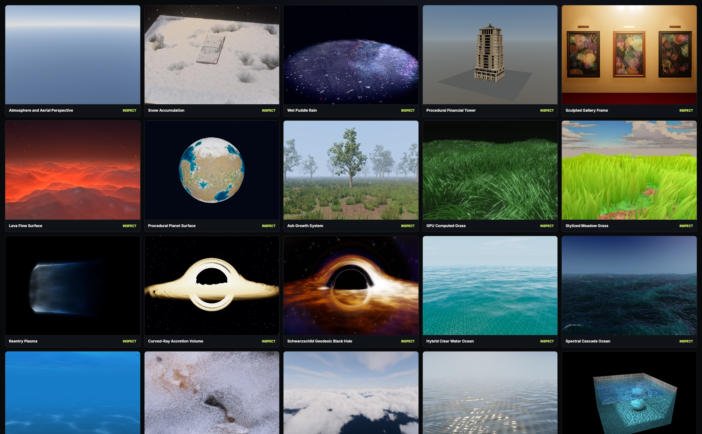

# Three.js Awesome Graphics Agent Skills

[](https://github.com/scottstts/Threejs-Awesome-Graphics-Agent-Skills/stargazers)
[](https://www.npmjs.com/package/threejs-awesome-graphics-agent-skills)
[](https://www.npmjs.com/package/threejs-awesome-graphics-agent-skills)



***範例圖庫，可直觀檢視內含的範例***

這是一套用於製作出色視覺效果的 Three.js Agent Skills 套件。

內容涵蓋網格設計、光照、PBR 材質、紋理、Shader、TSL/WebGPU、GLSL、後製、寫實風格、風格化、粒子、程序式視覺效果、色彩管理、色調映射等。本 Skill 套件的**核心重點**是打造卓越的視覺效果，兼顧成熟的設計美學、理念、人體工學、感知與品味，讓畫面呈現應有的精緻度，擺脫廉價的取巧手法。

這不是 three.js API 速查表。本套件略過 3D 製作的基礎知識與概念（任何具備基本能力的 LLM 都已有相關內部知識），也不處理 three.js API 的技術細節（可直接查閱文件，或使用現有的 API 導向 Agent Skills）。只提示 Agent 製作「出色的視覺效果」，無法期待它直接產出理想成果；Agent 必須看到這類視覺效果的確切實作。本 Skill 套件要提供的正是精緻圖像實作的**語彙**，並搭配範例庫，讓 Agent 不只知道該做什麼，也清楚知道如何實作。

隨著更多具備出色視覺效果的 three.js 專案出現，本 Skill 套件也會持續更新。期望它能協助大家快速打造精緻的場景與遊戲，把心力放在遊戲邏輯、故事等內容上。


***例如，過去製作並微調這類寫實海洋效果需要數小時，甚至數天；現在可以直接使用***

## 運作模式

每個圖像系統都應公開：

- 可確定或可重現的輸入；
- 具名控制欄位與感知參數；
- 診斷輸出；
- 尺度、距離與時間穩定性規則；
- 系統有定義時，由明確機制支撐的品質或解析度層級；
- 未套用後製仍具可讀性的基準效果。

## Skills

| Skill | 專業領域 |
| --- | --- |
| `threejs-skill-router` | 將視覺目標拆解成最精簡且相關的專業系統。 |
| `threejs-camera-direction` | 鏡頭與分鏡設計、追逐／側向／環繞 Rig、物體相對座標框架、鏡頭交接、指標注視、浮動原點。 |
| `threejs-procedural-animation` | 解析式時間軸、重力轉向、場面調度、旋轉座標框架對接、彈簧、四元數對齊、碎片運動。 |
| `threejs-procedural-fields` | 共用純量／向量場、頻帶、域扭曲、因果遮罩、程序式法線。 |
| `threejs-procedural-materials` | 結合紋理與程序場的 PBR 土壤／苔蘚、圖集過濾、鏡面反射抗鋸齒、行星材質、地形濕潤、熔岩／自發光表面、框架 PBR、逐實例溶解。 |
| `threejs-parallax-occlusion-mapping` | TSL 高度步進、裁切的平面與曲面輪廓、膨脹式浮雕殼層、自陰影、感知浮雕的陰影深度。 |
| `threejs-procedural-geometry` | 雕塑式框架導軌、枝條環、語意網格寫入器、UV 密度、材質群組。 |
| `threejs-procedural-vegetation` | 生長階層、貼合表面的常春藤、風格化與 GPU 運算草地、枝條環幾何、葉片法線、根部固定的風動效果。 |
| `threejs-procedural-architecture` | 量體與立面文法、外露邊緣分析、模組、材質槽編譯。 |
| `threejs-procedural-planets` | 球形地形、山脊、隕石坑、生物群系、程序式法線、高度過濾。 |
| `threejs-spectral-ocean` | 經驗證的 FFT 合成、FFT/Gerstner 混合水面、風格化水上／水下光學、水下 Snell 視窗、全反射、水體透視、焦散體積光、頻譜級聯、波峰陡峭度導數、Jacobian 泡沫、海洋著色。 |
| `threejs-water-optics` | 共用解析式波浪／法線、有限邊界泳池高度場、物體漣漪、焦散、折射、吸收、反射。 |
| `threejs-precipitation-surfaces` | 與積雪／積水耦合的降雪與降雨、積雪頂層、濕潤水窪、漣漪法線、飛濺效果及共用天氣包絡。 |
| `threejs-atmosphere-aerial-perspective` | 共用 Rayleigh/Mie 大氣、天空、大氣殼層／後製交接、深度式散射。 |
| `threejs-volumetric-clouds` | 由天氣塑形的密度、有限邊界光線步進、雲層光照、歷史資料、雲影。 |
| `threejs-raymarched-space-effects` | 曲線光線積分、黑洞、吸積盤、蟲洞、有限品質層級。 |
| `threejs-procedural-vfx` | 重返大氣層外殼／尾流、實例化火花、溶解碎片、密集粒子池、HDR 階層。 |
| `threejs-temporal-surfaces` | 持久觸碰歷史、霜凍合成、濕窗水滴、背景折射與模糊。 |
| `threejs-shadow-systems` | 具更新預算與失效機制的穩定級聯陰影及快取 Clipmap 陰影。 |
| `threejs-screen-space-ambient-occlusion` | GTAO 風格地平線取樣、彎曲法線、雙邊與時間重建。 |
| `threejs-bloom` | HDR 擷取、多尺度過濾、選擇性貢獻、曝光耦合。 |
| `threejs-exposure-color-grading` | 編碼亮度測光、非對稱曝光適應、色調映射、產生式 3D LUT。 |
| `threejs-image-pipeline` | 多個影像空間系統之間共用的渲染訊號所有權與排序。 |
| `threejs-visual-validation` | 固定視角擷取、診斷拼圖、種子／尺度掃描、時間與 GPU 證據。 |

## 安裝

```sh
# 全域安裝
npx threejs-awesome-graphics-agent-skills@latest install --agent codex
npx threejs-awesome-graphics-agent-skills@latest install --agent claude-code
npx threejs-awesome-graphics-agent-skills@latest install --agent cursor

# 專案安裝
npx threejs-awesome-graphics-agent-skills@latest install --agent github-copilot --scope project

# 任意自訂 Agent
npx threejs-awesome-graphics-agent-skills@latest install --agent custom --path designated-agent-skills-dir

# 強制重新安裝目前已安裝的相同版本
npx threejs-awesome-graphics-agent-skills@latest install --agent gemini-cli --force

# 解除安裝
npx threejs-awesome-graphics-agent-skills uninstall --agent codex
```

支援的目標：

| 目標 | 使用者範圍 | 專案範圍 |
| --- | --- | --- |
| `universal` | `~/.agents/skills` | `.agents/skills` |
| `codex` | `~/.codex/skills` | `.codex/skills` |
| `claude-code` | `~/.claude/skills` | `.claude/skills` |
| `cursor` | `~/.cursor/skills` | `.cursor/skills` |
| `github-copilot` | `~/.copilot/skills` | `.github/skills` |
| `gemini-cli` | `~/.gemini/skills` | `.gemini/skills` |
| `windsurf` | `~/.codeium/windsurf/skills` | `.windsurf/skills` |
| `custom` | 指定的 `--path` | 指定的 `--path` |

## 開發

```sh
npm run validate
npm test
npm run check:freshness
npm pack --dry-run
```

產生可重現的畫面擷取與縮圖索引表：

```sh
npm run capture:examples
```

透過單一開發介面檢視所有內含的圖像範例：

```sh
npm run dev:examples
```

圖庫用於直觀檢視 Skill 套件中的各個範例。每個 Skill 僅包含該範例本身的實作與資產；場景設定、Camera Rig、輔助實作與輔助資產則僅由圖庫的開發 Shim 管理。

這項拆分是刻意設計的：

- 使用此 Skill 的 Agent 只需要範例本身的實作與資產
- 圖庫僅供檢視，Agent 不需要了解其場景設定

圖庫介面契約記錄於
[`dev/example-gallery/README.md`](dev/example-gallery/README.md).
